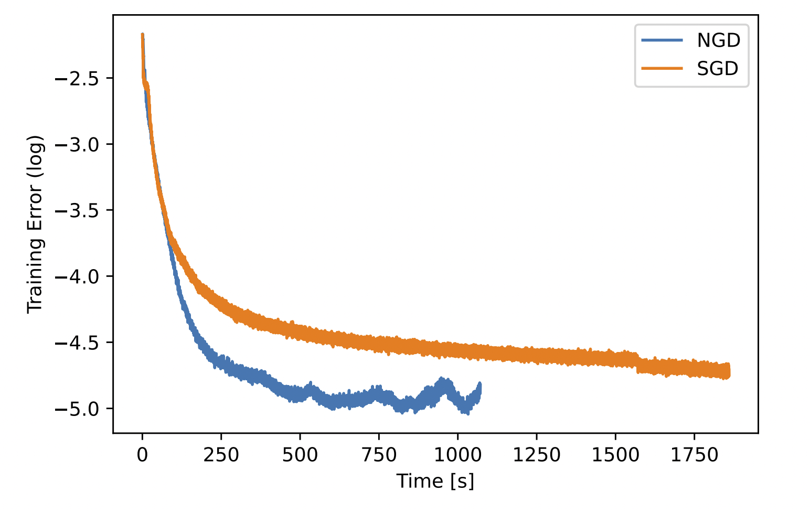
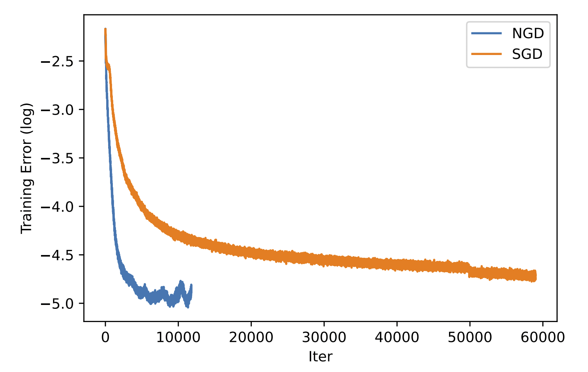

# Math 273A Final Project: Natural Gradient Descent

[Yadi Cao](https://eydcao.github.io/), [Yunuo Chen](https://www.math.ucla.edu/~yunuoch) and [Xuan Li](https://www.math.ucla.edu/~xuanli1)

In this project, we implemented natral gradient computation in [Exact natural gradient in deep linear networks and application to the nonlinear case](https://proceedings.neurips.cc/paper/2018/hash/7f018eb7b301a66658931cb8a93fd6e8-Abstract.html) and tested on Autoencoder.

